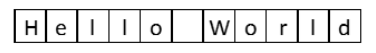
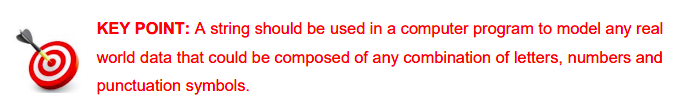

# Introduction
In Section 1 we defined a string as any text enclosed inside quotation marks. Strings are important simply because, along with numbers, they are by far the most common type of data processed by computer programs and systems.
The value of a string can either be a string literal or any Python expression that results in a string. 

Some examples of simple string literals are listed below:
````
"Please enter your name: ”

"John Doe”

“+353-85-1234567”

“182 C 999”

“@PDSTcs Python CPD for #LCCS teachers”

“http://www.youtube.com/watch?v=hUkjib”
````

The individual symbols that make up a string are called *characters.* 

Notice from the above examples that characters can be letters, numbers, spaces, punctuation marks and basically any symbol your keyboard will allow you to enter. e.g numbers `0-9`,letters ` ABC / abc,` special characters` ! £ $ % @ & \`.

## Storing Strings 📦
It is useful to think of the individual characters of a string being stored in consecutive locations of the computer’s memory. 

For example, string `"Hello World"` could be thought of as 
follows:



Internally, computers store unique numeric codes for each character and not the actual characters themselves. 

💡 *Remember our ASCII reference: A = 65, B = 66, & = 38 etc.*

## When to use a String? 🤔
Examples of string data include names, addresses, phone numbers, passwords, email texts, Facebook posts, SMS text messages, tweets, product codes, descriptions – the list is endless. 



In fact, most of the data you see on your mobile phone and on the world wide web are represented by strings. 

Common examples include phone ‘numbers’, vehicle registration ‘numbers’ and Personal Public Service Numbers (PPSN).


