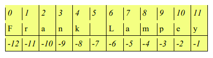
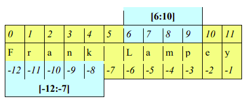

# Strings in more detail _(textbook tasks)_ 
The following tasks are from pages 21 - 23 of your book.


## String indexing
Python gives every item (sometimes called an element) in a 
string an index number, starting with `0` for the first item in the string. 

This allows Python to retrieve and work with each item separately.

Looking at the diagram below, note that the string index, 
shown on the top row, starts at `0` and ends at `11`. 



Python has an additional way to index a string, called the reverse string index, which starts at ``-1`` and ends at ``-12`` (shown on the bottom row). 

💡 _There are 12 items in total in the string._

To use string indexing to extract a single item, use square 
brackets `[ ]` and the index after the string variable name. 

### Some examples may make this clearer:

👉 1. Type these lines:
````py
myString = "Frank Lampey"
print(myString[11])
````
🤔 What is your output??

Alternatively, we could use _reverse indexing_

👉 2. Type these lines:
````py
myString = "Frank Lampey"
print(myString[-1])
````
🤔 What is your output??

## Substrings
Sections of a string are often called substrings (or slices). 
They are indexed using square brackets, e.g. ``[6:10]`` refers to index numbers ``6, 7, 8,`` and ``9``. 
Index number ``10`` is not included. 

In other words ``[6:10]`` means the section that starts 
at index number ``6`` and finishes just before index number ``10``.



_Reverse indexing_: ``[-12,-7]`` refers to the section starting at ``-12`` and finishing just before reverse index number ``-7``. In the square brackets, we put the lower index number first.

### Investigate - Modify - Make
  
👉 To print the section of the string ``[6:10]``, type these lines:
````py
myString = "Frank Lampey "
print(myString[6:10])
````
🤔 What is your output??

👉 Write some code to print the same section but using 
reverse indexing.

There is a third string indexing option available in Python. 

If no value is supplied as the first argument, e.g. ``[: 5]``, this substring starts at index number ``0``, and finishes just before index number ``5``. 

Substring ``[6 :]`` starts at index number ``6`` and continues up to and including the last item, which is index number ``11``.

👉 Type and run:
````py
myString = "Frank Lampey"
print(myString[:5])
print(myString[6:])
````
🤔 What is your output??

👉 We can experiment using the ``len()`` function as follows:
````py
myString = "Frank Lampey"
print(myString[len(myString)-1])
````


💡 _Note that the index number for the last string item is one 
less than the value of the length of the string._

### To find if a Substring is present: 🕵️‍♂️
To examine whether a substring is in a string, we can use a 
function called ``__contains__``. Note that we are using a 
double underscore here.

Let’s use this to find out if the substring ``" "`` _(a space)_ is in the string "Jeremiah Jones". 

👉 Type these lines:
````py
myName = "Jeremiah Jones"
print(myName.__contains__(" "))
````
<details> 
  <summary> Answer 👀</summary>
  
  The output is the Boolean value ``True`` because the substring is present.
</details>

If the substring is absent, the result will be the Boolean value False. 
👉 Try:
````py
myName = "JeremiahJones"
print(myName.__contains__(" "))
````
There is no space in the string this time so the output is:

<details> 
  <summary> Answer 👀</summary>

  `FALSE`
  
</details>

### To locate a Substring: 🕵️‍♂️

The ``index()`` function finds a given item in a string and returns its index number. If the same item occurs more than once, the ``index()`` function returns the first index number, starting from ``0``.

For example, let’s find the location of the substring ``" "`` in the string "Jeremiah Jones". 

👉 Type these lines:
````py
myName = "Jeremiah Jones"
spaceLoc = myName.index(" ")
print("Location of space:", spaceLoc)
````
<details> 
  <summary> Answer 👀</summary>

The index number for the substring ``" "`` is ``8``. 

This value is assigned to the variable ``spaceLoc``.
  
  
</details>

The character ``"e"`` occurs three times in the string "Jeremiah Jones". 

Experiment with the code above and the ``index()`` function to see which index number is 
returned.

### Extra Credit: ✨

What if the substring is _not_ present?

👉Change your script to locate ``"z"``, which is not in the string. 

👉What output do you get?


