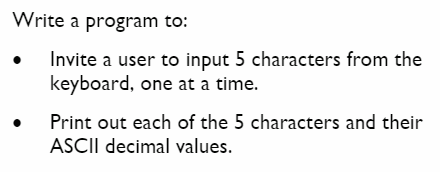
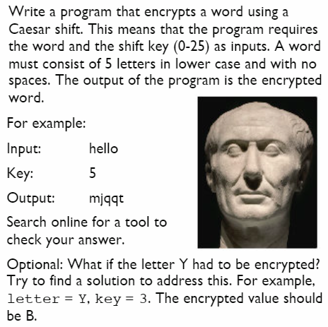

# Textbook Tasks
These tasks are taken from p25 - 26 of your book

## Challenge
Complete the following in `main.py` and again remember to use ``#comments`` as necessary to describe the more complex parts of your code.

## 👉Task 1 📚

  
💡 Hint

  The ``index()`` function finds a given item in a string and returns its index number.

*Check page 23 of your book for more info.*

## 👉Task 2
 

💡 *Hint: 1 hour = 60 min, 1 min = 60s.*

## 👉Task 3

  
💡 Hint

The `ord()` function takes a character and returns the ASCII decimal value.

## 👉 Task 4 

  
💡 Hint

The `ord()` function takes a character and returns the ASCII decimal value.

The `chr()` function takes an ASCII decimal value and returns the character.

The `len()` function counts the number of characters in a string.

>
>

