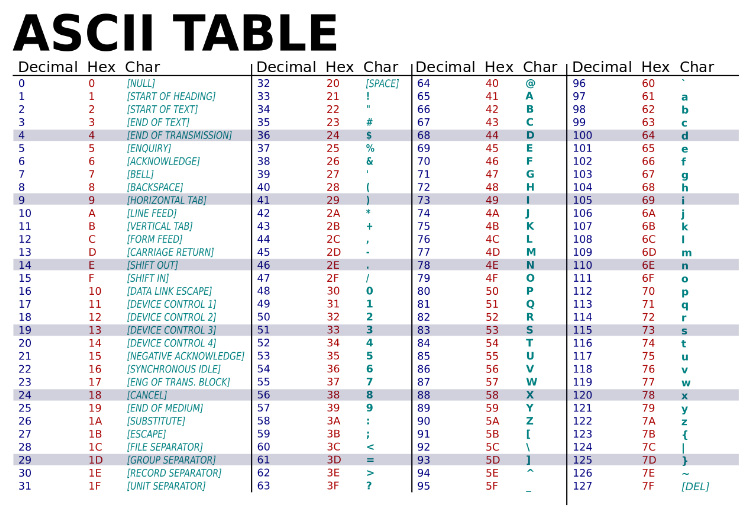
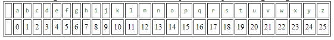

# Caesar Shift - Solution

Note the ASCII Unicode (decimal) values of the characters on your keyboard:
 

We can carry out the *Caesar Shift Cipher* without too much difficulty using `ord()` and `chr()`.

However, where it becomes difficult, is when we want to loop back within the alphabet and not onto *"special characters"* like `} , | , {`.

To do this we must use the *modulus operator*: `%`.

This will allow us to loop within the range of the alphabet. Imagine all the letters having a corresponding numerical value like below:

``a, b, c, ... y, z`` = ``[0][1][2],...[24][25] ``

Therefore if we use `% 26` we will loop back from ``z -> a``

Now, we can view our enciphering as taking the number corresponding to the letter, adding ``3`` to it *(Caesar Shift)*, and then writing down the letter that corresponds to the sum. 

If the result is 26 or larger, we subtract 26 so that if falls back in the desired range.

This type of arithmetic is called *addition modulo 26* or just adding *mod 26*.

## Useful Links
Use these links to help understand this topic more.
  
  1. [Caesar Shift Cipher](https://www.khanacademy.org/computing/computer-science/cryptography/ciphers/a/shift-cipher#:~:text=The%20Caesar%20Cipher%20is%20a,want%20to%20see%20our%20message.) 

 2.  [Caesar Cipher and Modular Arithmetic](http://www.math.stonybrook.edu/~scott/papers/MSTP/crypto/3Caesar_Cipher.html)

  